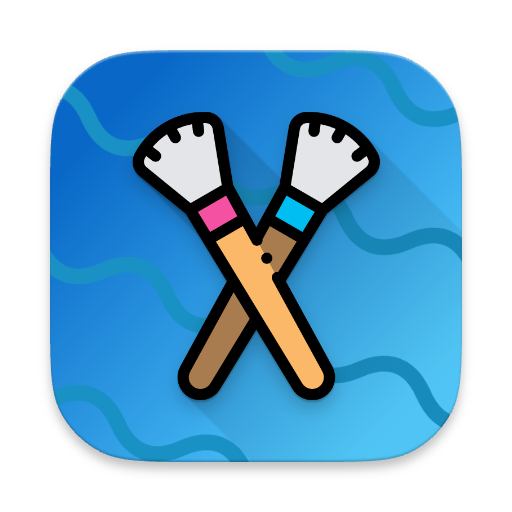

<p align="center">
  
</p>

<h1 align="center">Easel</h1>

<p align="center">
  AI-native design studio. Design on a canvas with multiple AI agents working alongside you.
</p>

<p align="center">
  <a href="#features">Features</a> &middot;
  <a href="#getting-started">Getting Started</a> &middot;
  <a href="#roadmap">Roadmap</a> &middot;
  <a href="#license">License</a>
</p>

---

## What is Easel?

Easel is an open-source design studio powered by multiple AI agents. It combines a full-featured vector canvas with an AI-driven workflow where parallel agents can generate, iterate, and refine designs with you in real time. Built as a native desktop app with Tauri for speed and privacy.

<p align="center">
  
</p>

## Tech Stack

Tauri v2 &middot; React 19 &middot; Fabric.js v7 &middot; Zustand v5 &middot; Tailwind v4 &middot; shadcn/ui &middot; Motion &middot; cmdk

## Features

### AI Studio

- Multiple AI agents (1-5) working in parallel with live status indicators
- Model selection (Claude Sonnet, Opus, Haiku)
- Per-tab AI sessions — each canvas gets its own conversation context
- File attachments for context-aware design assistance
- Floating chat widget with collapsible mini-bar

### Canvas & Drawing

- Rectangle, ellipse, and text tools
- Frame containers (like Figma's frames) with child nesting
- Drag-and-drop layer reordering with visual drop indicators
- Pan and zoom (trackpad and mouse wheel)
- Snap-to-grid and smart alignment guides
- Copy, cut, paste with offset
- Undo/redo history (50 states)
- Z-order controls (bring to front, send to back)

### Components

- Mark any object as a component
- Component layers display with purple diamond icon and purple text
- Toggle component status from the properties panel

### Layers Panel

- Hierarchical tree view mirroring canvas z-order
- Expand/collapse frames
- Visibility toggle per layer
- Drag-and-drop reparenting (above, below, inside)
- Color-coded icons: blue for frames, purple for components

### Properties Panel

- Position, size, rotation controls
- Fill and stroke with color picker
- Opacity and corner radius
- Text properties: font family, size, weight, style, alignment, line height, character spacing
- System font detection
- Frame presets (Desktop, Tablet, Mobile)
- Alignment tools (relative to parent frame or canvas)
- Export to PNG, SVG, JPEG at configurable scale
- Collapsible edge-anchored mini panel when closed

### Multi-Tab Support

- Multiple canvas tabs with independent state
- Per-tab canvas serialization and restore
- Per-tab AI chat sessions

### UI

- Custom macOS title bar with traffic light positioning
- Command palette (Cmd+K) with tools, edit, view, AI, and system commands
- Settings dialog
- Keyboard shortcuts for all major actions
- Dark theme throughout

## Getting Started

```bash
# Install dependencies
pnpm install

# Run in development
pnpm tauri:dev

# Build for production
pnpm tauri:build

# Type check
pnpm typecheck

# Lint
pnpm lint
```

## Keyboard Shortcuts

| Shortcut         | Action                  |
| ---------------- | ----------------------- |
| V                | Select tool             |
| R                | Rectangle tool          |
| O                | Ellipse tool            |
| T                | Text tool               |
| F                | Frame tool              |
| H                | Hand (pan) tool         |
| Cmd+C            | Copy                    |
| Cmd+X            | Cut                     |
| Cmd+V            | Paste                   |
| Cmd+D            | Duplicate               |
| Cmd+Z            | Undo                    |
| Cmd+Shift+Z      | Redo                    |
| Cmd+K            | Command palette         |
| Cmd+J            | Toggle AI chat          |
| Cmd+\            | Toggle layers panel     |
| Cmd+.            | Toggle properties panel |
| Cmd+,            | Settings                |
| Delete/Backspace | Delete selected         |
| ]                | Bring to front          |
| [                | Send to back            |

## Roadmap

- [ ] AI agent backend integration (currently placeholder responses)
- [ ] AI-driven design generation directly on canvas
- [ ] Multi-agent orchestration — agents for layout, color, typography, content
- [ ] Persistent storage via Tauri/Rust IPC
- [ ] Component instances and overrides
- [ ] Auto-layout / flex containers
- [ ] Multiplayer / real-time collaboration
- [ ] Plugin system
- [ ] Vector pen tool and boolean operations
- [ ] Prototyping and interactions
- [ ] Design tokens and styles
- [ ] Asset library and image support
- [ ] Export to code (HTML/CSS, React, SwiftUI)

## Project Structure

```
src/
  features/
    studio/           # Design canvas, toolbar, layers, properties
      components/
      hooks/
      store/
      types/
      utils/
    chat/             # AI agents and chat
      components/
      store/
      types/
  components/ui/      # shadcn/ui primitives
  hooks/              # Shared hooks
  lib/                # Utilities
```

## License

MIT
